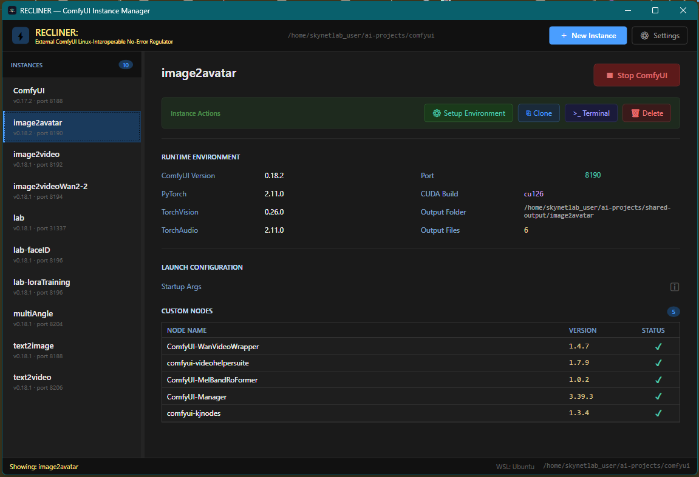

# RECLINER

> **RECLINER:** **E**xternal **C**omfyUI **L**inux-**I**nteroperable **N**o-**E**rror **R**egulator
ComfyUI breaks every time you touch it. 
Drive in RECLINER-- all Comfy, no crash

**FOR WSL/Linux Instances Running on Windows 10/11 ONLY**

RECLINER eliminates ComfyUI crashes caused by custom node, PyTorch + CUDA, ComfyUI, and Python version conflicts. 


RECLINER's instance management automation allows isolation of ComfyUI workflows within their own excluisive instance using their own custom nodes, PyTorch + CUDA, and ComfyUI version = no more version conflict, ever.

Clone, backup, view, and create new workflow instances with one click.

Instances share a single models directory and have their own subdirectory in a shared output directory. 

---

** HOW TO USE **

## Already have ComfyUI running in WSL?


1. Download the .exe
2. Run the .exe
3. Click **⚙ Settings**
4. Set shared model, shared output, and parent ComfyUI directory.

Your current ComfyUI instance can now be cloned.
Isolate new workflows into their own instances.
Create new instances (auto cloned repo) with one click,
Setup environments (Install PyTorch/Vision/Audio, etc) with one click.
If you break ComfyUI for any reason, it's limited to one workflow

---

## Never used ComfyUI before?

Start here — in order.
<details>
<summary>### 1. Check if you have WSL2</summary>

WSL2 (Windows Subsystem for Linux) is built into Windows 10/11. It lets you run Linux software without leaving Windows. ComfyUI runs inside it.

To check, open PowerShell and run:
```
wsl --list --verbose
```

If you see a distro listed (Ubuntu is the most common), you're set. If you get an error or an empty list, install WSL2:
```
wsl --install
```
Restart your machine when prompted. Ubuntu installs by default.
</details>
<details>
<summary>### 2. Download RECLINER</summary>

Grab `RECLINER.exe` from the [Releases](../../releases) page. Drop it anywhere. Run it.
</details>
<details>
<summary>### 3. Configure Settings</summary>

Click **⚙ Settings** on first launch:

| Settings & Key Concepts |
|---|---|
| WSL Distro | The name from your `wsl --list` output — usually `Ubuntu` |
| Parent Directory | A WSL folder that will hold all your ComfyUI instances — e.g. `/home/yourname/comfyui` |
| Shared Models Path | One central folder for all your model files (checkpoints, LoRAs, etc.) |
| Shared Output Path | Where generated images go, organized by instance |
| CUDA Tag | Your GPU's CUDA version — `cu124` for most modern NVIDIA cards, `cpu` if no GPU |
</details>
<details>
<summary>### 4. Create your first instance</summary>

Click **＋ New Instance**. RECLINER clones ComfyUI, creates a Python virtual environment, installs PyTorch, and sets everything up automatically. When it's finished your instance appears in the sidebar.
</details>
---

## Shared Folders

When you have multiple ComfyUI instances, you don't want 50GB of model files copied into each one. The shared models folder solves this — all instances read from one central location. RECLINER wires each new instance to it automatically.

**Is it mandatory?** No. If you already have ComfyUI with models in the default location, RECLINER will manage it as-is. Shared folders only matter when you start creating additional instances.

The shared output folder works the same way. Each instance gets its own subfolder inside it, so generated content stay organized without mixing between environments.

---

## Clearer Vision, Faster Answers

- **Isolation** — each instance is its own Python venv. Installing a node in one instance cannot break another instance.
- **Versions** — see ComfyUI version, PyTorch, CUDA build, TorchVision, TorchAudio per instance at a glance. Easily compare instances, root causes for crasshes are identified quickly and easily.
- **Custom nodes** — full inventory per instance, enabled/disabled state visible
- **Ports** — each instance runs on its own port, editable inline
- **Startup flags** — configure `--lowvram`, `--preview-method auto`, etc. per instance with an in-app reference
- **Launch** — one click opens the terminal and once ready, the browser window at the specific port opens automatically.
- **Live updates** — RECLINER displays configuration state in near real-time

---

## Prerequisites

- Windows 10 or 11
- WSL2 (see above — likely already installed)
- That's it for the self-contained exe

To build from source: .NET 8 SDK

---

## Build From Source

```bash
git clone https://github.com/skynet-labs-admin/RECLINER.git
cd RECLINER
dotnet build -c Release
# Output: bin/Release/net8.0-windows/RECLINER.exe

```

---

## RECLINER For Her
Themed for women who AI (or anyone who likes these colors)
Settings > Scroll to bottom > Select > Save Changes


---

## License
Apache 2.0 — see [LICENSE](LICENSE)


RECLINER is written in C# and Python by:

Oscar Hammons IV
2300 Dynasty, LLC
Cybersecurity - Agentic AI Automation - Video Production
